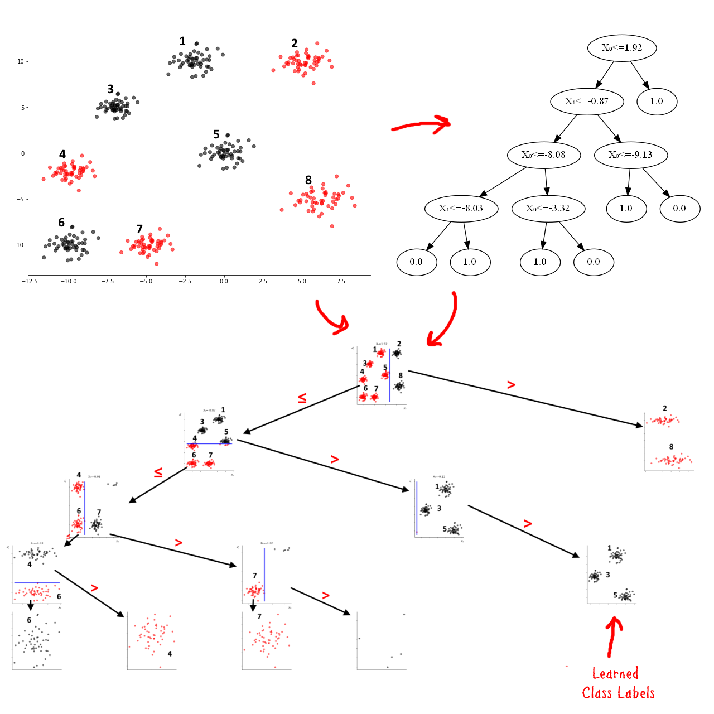

# ML Basics (Part-4): Decision Trees
## How to build and Apply Decision Trees in Python using Numpy

## Requirements

* Python 3
* Numpy
* scikit-learn (needed only for sample data generation)

## Running The Notebook

* Open the Notebook in Google Colab or local jupyter server
* Install the requirements
* Restart the kernel if necessary 

## The tutorial 📃

The full tutorial is available on following links:

On Medium:

https://azad-wolf.medium.com/ml-basics-part-4-decision-trees-cc37d07137b2

On Substack:

https://azadwolf.substack.com/p/ml-basics-part-4-decision-trees

